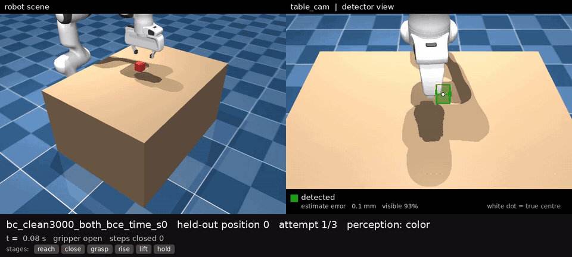

# franka_cube_lift

Behaviour cloning on a Franka Panda cube-lift task in MuJoCo. A scripted
controller (`scripts/controller.py`) generates demonstrations; an MLP policy
(`scripts/train_bc.py`) learns to imitate it from state. Since v4.0 the cube's
position comes from a camera and detector instead of the simulator.

This cube-lift policy is the first skill of a larger goal: a harness for an
agentic robotics system. See [PLAN.md](PLAN.md) for the roadmap.

[](videos/system_color.mp4)

*v4.0, the whole system at 2× speed. Left: the robot. Right: what `table_cam`
sees, with the detected red pixels tinted and a wireframe cube at the position
the policy is using (green = accepted detection, orange = rejected, holding the
last estimate, red = no estimate yet); the white dot is the true centre. The
last clip is the start-of-episode blind spot (seed 2, position 151): the hand
hides the cube, attempt 1 fails, the retry succeeds. Click for the full
real-time video.*

## Versions

3 training seeds per version (3000 demos, 100 epochs). The last column is
lenient success on the 50-position set used while debugging; the held-out
[benchmark](#benchmark-results) below is the number to report.

| Version | Change | Inputs | Gripper | Debug set, seed 0 / 1 / 2 | Mean |
|---|---|---|---|---|---|
| v1.0 | Baseline | 17 (world) | MSE, raw command | 86 / 12 / 78% | 58.7% |
| v1.1 | Snap gripper to open/closed at rollout | 17 (world) | MSE, snapped | 98 / 96 / 76% | 90.0% |
| v2.0 | Gripper as classifier; add gripper-frame cube position | 20 (both) | BCE logit | 100 / 92 / 80% | 90.7% |
| v3.0 | Add steps-since-gripper-closed input | 21 (both + counter) | BCE logit | 100 / 100 / 100% | 100% |
| **v4.0** | **Cube position from camera + color detector (v3.0 policy unchanged)** | **21, cube position estimated** | **BCE logit** | **not run on the debug set** | **—** |

What each version fixed:

- **v1.1**: MSE regression blurs the binary open/close label. Some seeds
  half-closed the gripper ~8 cm above the cube mid-descent, left the training
  distribution, and drifted away without touching it
  (`scripts/diag_collapse.py`). Snapping the command removes the collapse.
- **v2.0**: trains the gripper as what it is, a binary decision
  (`BCEWithLogitsLoss`). Every seed now reaches and grasps the cube in 50/50
  episodes. Remaining failures: the policy grasps the cube and then freezes.
- **v3.0**: after closing, the expert holds still for exactly 120 steps and
  then lifts, on an internal timer a single frame cannot see. The added input is
  the number of consecutive steps the gripper has been commanded closed
  (capped at 200, scaled by 1/100). It is built from the expert's labels in
  training and from the policy's own past gripper commands at rollout.
- **v4.0**: removes the simulator's true cube position from the policy's
  inputs. A fixed RGB-D camera and a color detector estimate it at 10 Hz; see
  [Perception](#perception-v40).

Train v3.0:

```bash
python train_bc.py --demos ../demos/clean3000.npz --frame both \
    --grip-loss bce --time-feature --seed 0 \
    --out ../models/bc_clean3000_both_bce_time_s0.pt
```

Checkpoints: `models/bc_clean3000_both_bce_time_s{0,1,2}.pt` (v3.0),
`models/bc_clean3000_both_bce_s{0,1,2}.pt` (v2.0). Re-score any checkpoint on
the standard eval with `python eval_bc.py <checkpoint>...`.

v1.0 numbers use the original rollout, which sent the raw gripper output. The
rollout now always snaps it, so re-evaluating a v1.0 checkpoint gives the v1.1
number (`benchmark.py --raw-grip` reproduces v1.0).

## Benchmark results

200 held-out cube positions (never used for debugging), up to 3 attempts each,
3 seeds per version. Mean over seeds; definitions in
[Evaluation](#evaluation).

| Version | Stage score | Success@1 | Success@3 | Mean attempts | Lifted@1 (old) |
|---|---|---|---|---|---|
| v1.0 | 64.7 | 58.7% | 67.5% | 1.14 | 58.7% |
| v1.1 | 94.5 | 89.0% | 97.7% | 1.11 | 89.2% |
| v2.0 | 95.4 | 86.8% | 93.0% | 1.08 | 92.3% |
| v3.0 | 100 | 100% | 100% | 1.00 | 100% |
| **v4.0** (camera) | **99.3** | **99.3%** | **99.8%** | **1.01** | **99.3%** |

Stage funnel, % of positions reaching each stage on attempt 1 (mean over seeds):

| Version | reach | close | grasp | rise | lift | hold |
|---|---|---|---|---|---|---|
| v1.0 | 69.2 | 69.2 | 69.2 | 63.3 | 58.7 | 58.7 |
| v1.1 | 100 | 99.7 | 99.7 | 89.3 | 89.2 | 89.0 |
| v2.0 | 100 | 100 | 100 | 93.0 | 92.3 | 86.8 |
| v3.0 | 100 | 100 | 100 | 100 | 100 | 100 |
| v4.0 | 99.3 | 99.3 | 99.3 | 99.3 | 99.3 | 99.3 |

What the results show:

- **v3.0 holds on unseen positions**: 600/600 first-attempt strict successes.
- **v4.0 loses less than a point to perception** (99.3% first attempt, 99.8%
  within 3). All its failures are the start-of-episode blind spot described in
  [Perception](#perception-v40).
  The debug-set numbers track the held-out ones closely, so the debug set was
  not badly overfit.
- **v1.0 fails at the approach** (69% reach) because of the gripper collapse;
  seed 1 fails the same way every time (12% → 13% with retries).
- **v2.0 drops the cube**: 92.3% lifted but 86.8% held. Its failures are drops
  during the lift or lifts too late to finish the hold.
- **Retries help when failures leave a familiar scene.** v1.1 gains 8.7 points
  from retries (failed attempts leave the cube in place). v2.0 gains 6.2: a
  dropped cube tumbles to x ≈ 0.30 m, outside the 0.47–0.63 m training range,
  and the retry heads the wrong way. This is an early case of the handoff
  bottleneck in [PLAN.md](PLAN.md).

Run it:

```bash
python benchmark.py ../models/bc_clean3000_both_bce_time_s{0,1,2}.pt --label v3.0
python plot_benchmark.py        # results/benchmark_versions.png
```

`benchmark.py` appends one row per checkpoint to `results/benchmark.tsv`
(with the git commit). Options: `--positions`, `--attempts`, `--max-steps`,
`--raw-grip`, `--no-log`.

## Perception (v4.0)

```
table_cam (RGB-D, fixed) ──► color detector ──► 3D cube centre ──┐
                                                                 ▼
  joint angles, gripper width, gripper position ──────► v3.0 policy (unchanged)
```

- **Camera:** `table_cam` in `cube_lift_scene.xml`, fixed opposite the robot,
  0.73 m from the workspace centre, 47° down, 45° field of view, 640×480
  (`scripts/perception/camera.py`). Depth agrees with the scene geometry to
  0.56 mm, and the cube is in view at all 200 benchmark positions.
- **Detector** (`scripts/perception/detectors.py`): red-pixel mask → 3D points
  from depth → cube centre from the extent of the visible faces (top face and
  the face towards the camera, using the known 4 cm size).
- **Rejection and memory:** a detection counts only if ≥ 60% of the expected
  cube area is visible; otherwise the last good estimate is kept. Below 60%
  the error is 3–34 mm; above it, 0.2 mm median (measured during v3.0
  episodes). Before the first good detection, the workspace centre is used,
  never the true position.
- **Rate:** 10 Hz; the policy reuses the latest estimate in between.

**Error budget** (v3.0 with a degraded true position, before building the
detector; 3 seeds, 200 positions, 10 Hz):

| Cube position error | Success@1 | Success@3 |
|---|---|---|
| none (10 Hz only) | 100% | 100% |
| random, σ 1 mm | 100% | 100% |
| random, σ 2 mm | 99.8% | 100% |
| random, σ 5 mm | 92.7% | 98.2% |
| random, σ 10 mm | 64.3% | 79.3% |
| fixed offset 5 mm | 98.5% | 98.7% |
| fixed offset 10 mm | 95.2% | 96.0% |

The policy tolerates about 2 mm of random error and 5 mm of fixed offset.
Beyond that the loss depends strongly on the seed (seed 2 falls to 23.5% at
σ 10 mm).

**Camera results** (v3.0 policy, 3 seeds, 200 held-out positions):

| Cube position from | Success@1 (seeds 0 / 1 / 2) | Mean | Success@3 | Error median / p95 | Rejected |
|---|---|---|---|---|---|
| simulator (true) | 100 / 100 / 100 | 100% | 100% | 0 | — |
| **camera + color detector** | 100 / 100 / 98 | **99.3%** | **99.8%** | 0.2 / 7.1 mm | 0.6% |
| same, no rejection | 100 / 100 / 99 | 99.7% | 99.7% | 0.2 / 7.2 mm | 0.2% |

- **The detector is well inside the error budget** (0.2 mm median). The 7 mm
  95th percentile is the 10 Hz lag while the cube moves during the lift, which
  the error budget shows is harmless.
- **Rejection plus memory made no measurable difference.** Occlusion is rare
  along the policy's own path, so there is seldom anything to hold.
- **All failures are a start-of-episode blind spot.** For cubes close to the
  robot (x ≈ 0.47–0.50 m, y ≈ 0) the hand at its start pose hides the cube, so
  there is no good estimate yet. The policy starts from the workspace-centre
  fallback (56–79 mm off) and seed 2 never recovers. Memory can't help at step
  0; the planned fix is to make a valid detection a precondition for starting
  the skill ("look before acting").

Run it:

```bash
python benchmark.py ../models/bc_clean3000_both_bce_time_s{0,1,2}.pt \
    --label v3.0 --perception color            # add --min-visible 0 for no rejection
python benchmark.py <ckpt> --label v3.0 --perception noisy --pos-noise 5   # error budget
python make_bc_video.py --overlay --perception color \
    --clip ../models/bc_clean3000_both_bce_time_s0.pt:0 --out ../videos/system_color.mp4
```

## Evaluation

**Protocol** (`scripts/benchmark.py`):

- **Positions:** 200 cube positions drawn with rng seed 2026 from the training
  range (x 0.47–0.63 m, y ±0.15 m). Reporting only, never debugging.
- **Attempts:** up to 3 per position, 700 steps (14 s) each.
- **Retries:** the sim and policy are deterministic, so re-running from the
  same start would replay the same failure. A retry starts from where the last
  attempt left things: the arm returns home with the gripper open, and the
  cube stays wherever it ended up (pushed, dropped, tilted).

**Stages**, one point each; the furthest stage reached counts:

| Stage | Condition |
|---|---|
| reach | TCP within 15 mm of the cube centre in xy and 20 mm in z |
| close | gripper commanded closed while at the grasp pose |
| grasp | finger opening 30–50 mm while at the grasp pose |
| rise | cube centre 10 mm above its resting height |
| lift | cube centre 100 mm above its resting height |
| hold | lift sustained for 50 steps (1 s) with both fingers on the cube |

**Metrics:**

- **Stage score**: points from stages reached on attempt 1, out of 6,
  averaged over positions (%). *How far does the policy get?* It gives partial
  credit (always grasping but never lifting scores 50, never reaching scores
  0) but hides which stage fails.
- **Stage funnel**: % of positions reaching each stage on attempt 1. *Where
  does it fail?* The biggest drop between two stages locates the failure. This
  is how both of the v1 → v3 bugs were found.
- **Success@1**: hold reached on the first attempt. *How good is the skill
  on its own?* The headline measure of the skill with no help.
- **Success@3**: hold reached within 3 attempts. *Does it get there with a
  retry loop?* This measures the policy inside a minimal harness.
  Success@3 − Success@1 shows how recoverable its failures are.
- **Mean attempts**: attempts used, over positions that eventually succeed.
  *What does success cost?* Retries cost time and, on hardware, wear. It
  ignores failed positions, so read it next to Success@3.
- **Lifted@1**: cube 10 cm up on any single frame of attempt 1 (the original
  metric). It links to all earlier results. Lifted@1 − Success@1 counts drops
  and lifts too late to finish the hold.

How they fit together:

| Question | Metric |
|---|---|
| How good is the skill alone? | Success@1 |
| How close do the failures get? | Stage score |
| Where does it break? | Stage funnel |
| Can a retry loop rescue it? | Success@3 − Success@1 |
| What does rescue cost? | Mean attempts |
| Does it hold on, or just touch the threshold? | Lifted@1 − Success@1 |

The retry gap is an early form of the harness's *recovery rate*, and the funnel
an early form of *failure attribution* (see [PLAN.md](PLAN.md)).

## Setup

```bash
conda env create -f environment.yml
conda activate franka_cube_lift
cd scripts
```

Demos are not committed (`clean3000.npz` exceeds GitHub's file limit).
Regenerate them with:

```bash
python collect_demos.py --episodes 3000 --out ../demos/clean3000.npz
```

## Task

- Physics 500 Hz, policy 50 Hz (10 substeps per action).
- Cube placed uniformly in x 0.47–0.63 m, y ±0.15 m, unrotated.
- Success: cube lifted 10 cm and held for 1 s with both fingers on it (see
  [Evaluation](#evaluation)). Earlier results use the lenient single-frame
  check `env.lifted()`.
- Expert success: 100% (failed demos are discarded at collection time).
- Expert phases: hover, descend, close (hold 120 steps), lift.

## Policy (v3.0)

MLP 21 → 256 → 256 → 8 (ReLU, 73k params), AdamW lr 1e-3, cosine schedule,
batch 256, episode-level 90/10 split. Loss: MSE on the z-scored joint deltas
plus BCE on the gripper logit.

| Inputs (21) | Outputs (8) |
|---|---|
| `arm_q1..7`, `grip_width`, `tcp_xyz`, `cube_xyz`, `cube − tcp` (world), `cube − tcp` (TCP frame), steps closed / 100 | `dq1..7` (joint-target delta), gripper logit (open if > 0) |

Training options (defaults reproduce v1):

| Flag | Values | Effect |
|---|---|---|
| `--frame` | `world` (default), `gripper`, `both` | observation frame (`frame_features`) |
| `--grip-loss` | `mse` (default), `bce` | regress or classify the gripper |
| `--grip-weight` | float, default 1.0 | weight of the BCE term |
| `--time-feature` | flag | append steps-since-gripper-closed |

## Earlier experiments

Rollout success over the same 50 cube positions, with the original raw gripper
command (v1.0 rollout).

**Dataset size** (`results/sweep.tsv`, world frame):

| Demos | Epochs | Seeds | Success |
|---|---|---|---|
| ~300 (`state_demos`) | 340 | 0, 1, 2 | 48 / 52 / 60 → 53.3% |
| 1000 | 100 | 0, 1, 2 | 68 / 38 / 40 → 48.7% |
| 1000 | 340 | 0 | 22% |

**Observation frame** (3000 demos, 100 epochs):

| Frame | Seed 0 | Seed 1 | Seed 2 | Mean (raw) | Mean (snapped) |
|---|---|---|---|---|---|
| world | 86% | 12% | 78% | 58.7% | 90.0% |
| gripper | 84% | 90% | 4% | 59.3% | 80.7% |
| both | 16% | 98% | 78% | 64.0% | 94.7% |

With the raw command, runs were bimodal (78–98% or 4–16%) depending on seed,
not frame; that was the gripper failure fixed in v1.1. With it fixed, the frame
differences are within seed noise. Validation MSE never predicted rollout
success.

## Layout

```
scripts/   env, scripted expert, demo collection, BC training (train_bc.py),
           perception/ (camera, detectors), held-out benchmark with
           perception modes (benchmark.py, plot_benchmark.py), quick eval
           on the debug set (eval_bc.py), failure diagnosis (diag_collapse.py),
           video
models/    Panda + cube scene (MuJoCo Menagerie based) and BC checkpoints
results/   benchmark results and plot, dataset sweep
videos/    rollout videos (v1.0, v3.0), the v4.0 system video, README previews
```

The controller follows patterns from
[kevinzakka/mjctrl](https://github.com/kevinzakka/mjctrl) (commit `f1c82c2`).
